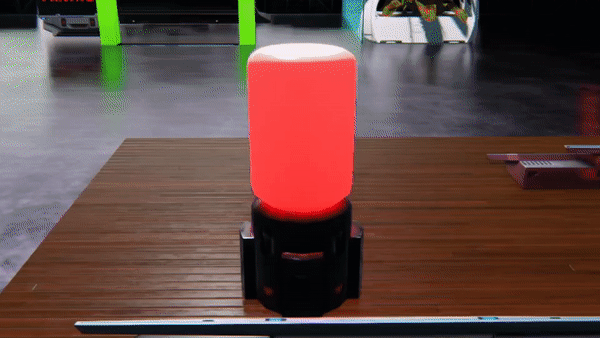
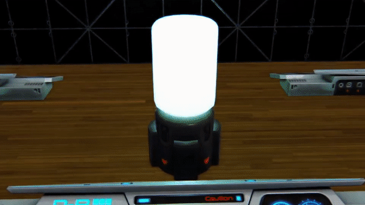
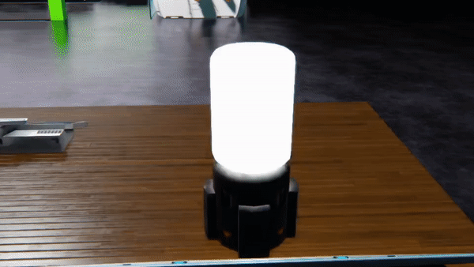

# Color Changer Script
## Description
A Dual Universe script for actively changing the colors of lights in nearly any pattern you like.

  
Police Red and Blue switches between red and blue 4 times a second
  
Slow Rainbow slowly shifts through many different colors by making small changes 10 times a second
  
Glitchy Lights switches from 0 to 255 brightness and back at random intervals between 0 and 0.2 seconds imitating a malfunctioning light

## Installation
1. Pick a style from the Premade folder and copy the contents.
2. Right click on a Programming Board and choose Paste from the Advanced menu
3. Link up to 10 lights to the board.
4. You can either activate the board directly or by using a detection zone, switch, etc.
5. If you don't like the premade settings, choose Edit Lua Parameters from the Advanced menu and change any of the settings you see. Hovering over a setting name should give you more of an idea of what they do.

## Upcoming features
- First: linking to a DataBank so you can have many more lights available. This is almost done, but still needs some tweaking
- Second: using a transmitter to share settings across cores
- Third: a touch screen with a nice UI and live previews to get just the look you want without having to fiddle with numbers and restarting PBs
